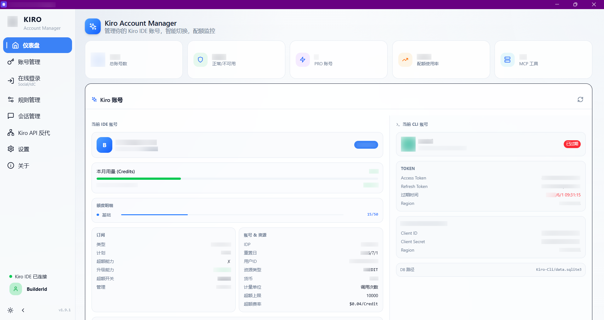
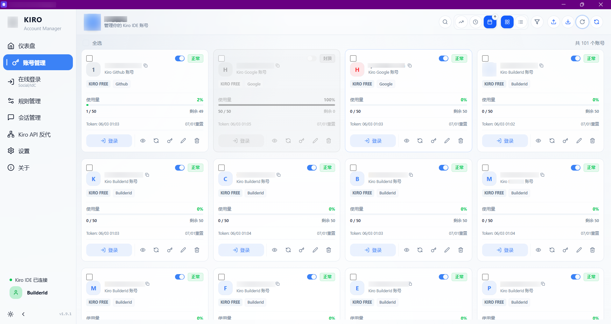
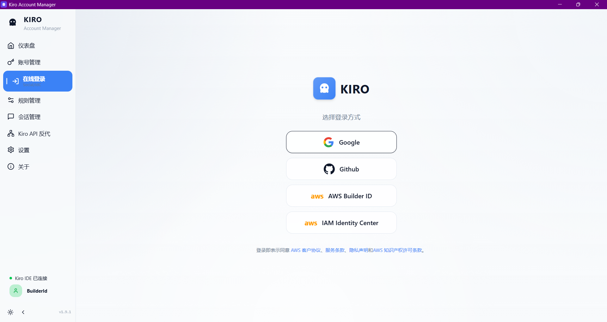
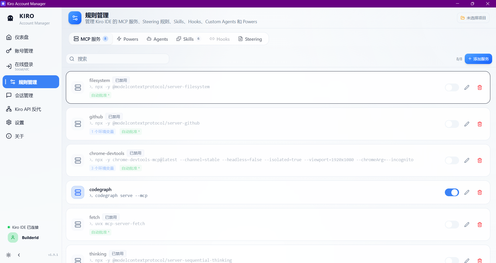
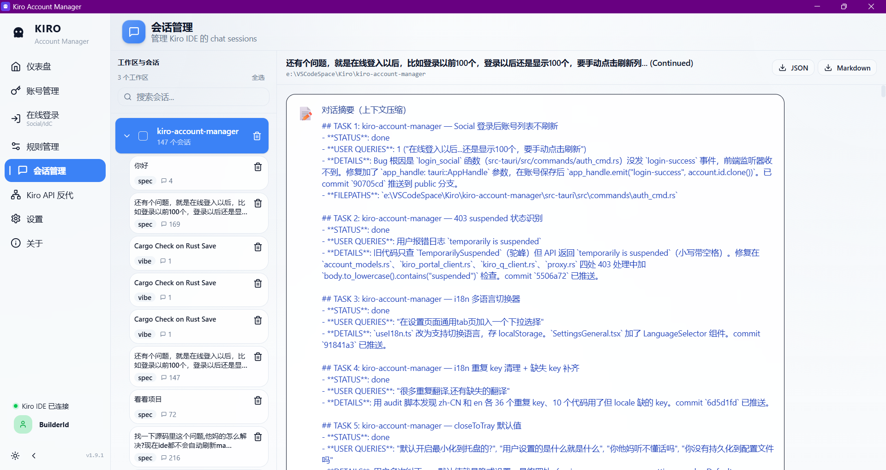
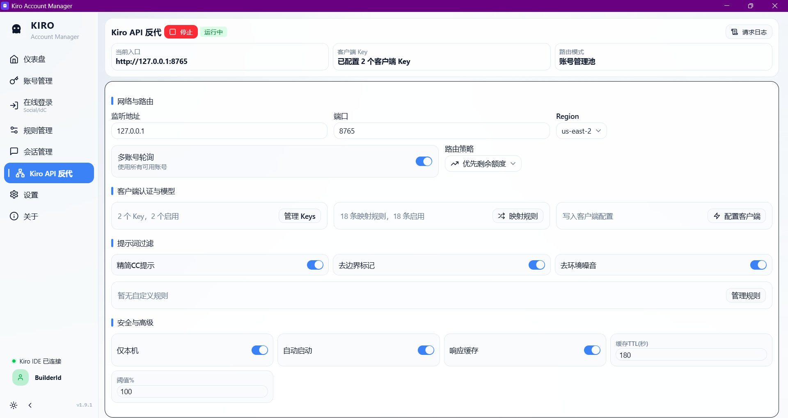
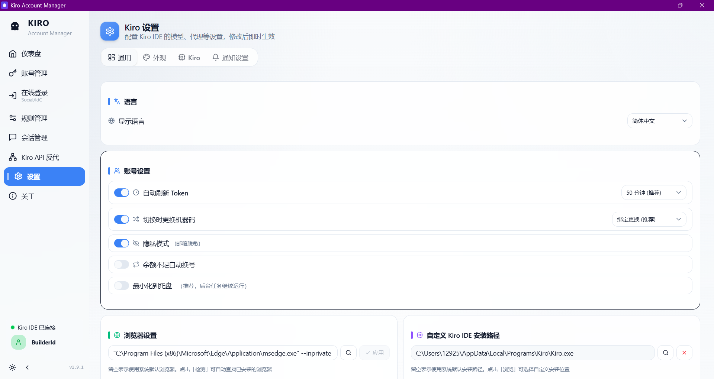
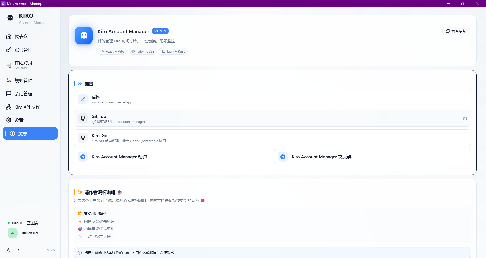

# Kiro Account Manager

<p align="center">
  
</p>

<p align="center">
  
  
  
  
  
  
  
</p>

<p align="center">
  <b>🚀 智能管理 Kiro IDE 账号，一键切换，配额监控</b>
</p>

<p align="center">
  🌐 <b><a href="https://kiro-website-six.vercel.app">官方网站</a></b> |
  📥 <b><a href="#-下载">立即下载</a></b> |
  💬 <b><a href="https://t.me/ide520">Telegram 讨论组</a></b> |
  📚 <b><a href="README_EN.md">English</a></b> |
  📚 <b><a href="README_RU.md">Русский</a></b>
</p>

> **📢 语言支持**：本项目支持**简体中文、English、Русский**三种语言界面。

---

## 🏗️ 项目概览

Kiro Account Manager 是一个基于 **Tauri 2.x** 的桌面应用，用于集中管理 **Kiro IDE** 账号与本地配置。

**技术栈**：React 18 + Vite + shadcn/ui + TailwindCSS 4 | Rust + Tauri 2.x | Windows / macOS / Linux

**核心模块**：
- 账号管理：导入、导出、刷新、验证、分组、标签、远程删除
- 登录认证：Google / GitHub Social OAuth，AWS IAM Identity Center（BuilderId / Enterprise）
- Kiro 集成：切换账号、同步模型 / 代理 / MCP / Steering / Skills / Hooks / Custom Agents / Powers
- 自动化能力：Token 自动刷新、余额不足自动换号、机器 ID 绑定与重置
- 桌面端能力：Deep Link OAuth 回调、单实例、系统托盘、自动更新
- 网关能力：内置 Kiro API Gateway，支持 Anthropic Messages、OpenAI Responses、Chat Completions 与流式转发

---

## 📥 下载

**最新版本 v1.9.1**（发布于 2026-06-02）：请前往 [Releases](https://github.com/hj01857655/kiro-account-manager/releases/latest)（自动保持最新）

> 以下下载链接可能滞后，以 Releases 为准。

| 平台 | 架构 | 文件格式 | 下载链接 |
|------|------|---------|---------|
| 🪟 **Windows** | x64 | MSI 安装包 | [KiroAccountManager_1.9.1_x64_zh-CN.msi](https://github.com/hj01857655/kiro-account-manager/releases/download/v1.9.1/KiroAccountManager_1.9.1_x64_zh-CN.msi) |
| 🪟 **Windows** | ARM64 | MSI 安装包 | [KiroAccountManager_1.9.1_arm64_zh-CN.msi](https://github.com/hj01857655/kiro-account-manager/releases/download/v1.9.1/KiroAccountManager_1.9.1_arm64_zh-CN.msi) |
| 🍎 **macOS** | x64 / Intel | DMG 镜像 | [KiroAccountManager_1.9.1_x64.dmg](https://github.com/hj01857655/kiro-account-manager/releases/download/v1.9.1/KiroAccountManager_1.9.1_x64.dmg) |
| 🍎 **macOS** | x64 / Intel | App 压缩包 | [KiroAccountManager_x64.app.tar.gz](https://github.com/hj01857655/kiro-account-manager/releases/download/v1.9.1/KiroAccountManager_x64.app.tar.gz) |
| 🍎 **macOS** | ARM64 / Apple Silicon (M1/M2/M3/M4) | DMG 镜像 | [KiroAccountManager_1.9.1_aarch64.dmg](https://github.com/hj01857655/kiro-account-manager/releases/download/v1.9.1/KiroAccountManager_1.9.1_aarch64.dmg) |
| 🍎 **macOS** | ARM64 / Apple Silicon (M1/M2/M3/M4) | App 压缩包 | [KiroAccountManager_aarch64.app.tar.gz](https://github.com/hj01857655/kiro-account-manager/releases/download/v1.9.1/KiroAccountManager_aarch64.app.tar.gz) |
| 🐧 **Linux** | x86_64 | AppImage | [KiroAccountManager_1.9.1_amd64.AppImage](https://github.com/hj01857655/kiro-account-manager/releases/download/v1.9.1/KiroAccountManager_1.9.1_amd64.AppImage) |
| 🐧 **Linux** | x86_64 | DEB 包 | [KiroAccountManager_1.9.1_amd64.deb](https://github.com/hj01857655/kiro-account-manager/releases/download/v1.9.1/KiroAccountManager_1.9.1_amd64.deb) |
| 🐧 **Linux** | x86_64 | RPM 包 | [KiroAccountManager-1.9.1-1.x86_64.rpm](https://github.com/hj01857655/kiro-account-manager/releases/download/v1.9.1/KiroAccountManager-1.9.1-1.x86_64.rpm) |

> **macOS 样式说明**：若出现样式显示异常，请基于当前仓库源码自行调整（我没有 macOS 设备，无法复现与调试）。

**系统要求**：
- **Windows**: Windows 10/11 (64-bit)，需要 [WebView2](https://developer.microsoft.com/microsoft-edge/webview2/) (Win11 已内置)
- **macOS**: macOS 10.15+ (Catalina 及以上)
- **Linux**: x86_64 架构，需要 WebKitGTK 4.0+

**安装说明**：
- **Windows**: 双击 `.msi` 文件安装
- **macOS**: 打开 `.dmg`，拖动到 Applications，首次运行在「安全性与隐私」中允许
- **Linux AppImage**: `chmod +x` 后直接运行
- **Linux DEB**: `sudo dpkg -i` 安装
- **Linux RPM**: `sudo rpm -i` 安装，或使用发行版对应包管理器安装

---

## 📝 更新日志

以下内容按 GitHub Release 的实际发布时间窗口整理；“未发布”包含 v1.9.1 发布之后已进入主分支、但尚未打包发布的改动。

### 🚧 未发布 — 账号隔离与 Kiro2API 可靠性补强

> 本阶段重点修复多账号长期使用中的状态串用问题：账号机器码改为随账号保存和切换，单账号代理独立生效，账号文件保存不再制造大量备份文件；同时继续补齐 Kiro2API 的错误透传、Responses 兼容和 Linux 软件渲染场景。

#### 🔑 账号机器码隔离
- **新增**: 账号级 `machineId` 持久化 — 导入、在线登录和账号数据规范化时，会为缺失机器码的账号生成独立随机值，后续不再依赖当前系统机器码临时补值。
- **修复**: 手动切号与自动换号都会写入目标账号自己的机器码 — 解决“账号已经切换，但请求头 / Kiro IDE 仍沿用旧机器码或当前系统机器码”的状态串用问题。
- **调整**: 移除旧版全局机器码兼容配置 — 现在切号逻辑统一以账号自身 `machineId` 为准，减少“配置开关”和“账号字段”同时存在造成的行为分歧。

#### 🌐 单账号代理与 BuilderId 兼容
- **新增**: 单账号代理配置 — 在账号编辑页可为特定账号配置独立代理，Kiro2API / Kiro API 请求按账号走对应出口，不影响 Kiro IDE、Kiro CLI 或系统代理。
- **修复**: BuilderId `profileArn` fallback — 针对 BuilderId 账号缺少 `profileArn` 时部分 Kiro API 请求失败的问题，补齐 fallback 逻辑，减少“能登录但请求失败”的情况。
- **优化**: 账号编辑页布局 — 分组、标签、代理、机器码等区域重新整理，避免搜索框和输入区域被标签区挤到下一行。

#### 💾 账号文件保存与恢复
- **调整**: 账号保存只保留最近一次 `.bak` — 不再每次保存都生成 `accounts.backup-*.json`，避免 AppData 下长期堆积大量备份文件。
- **修复**: `accounts.json` 缺失或写入失败时优先从备份恢复 — 解决保存过程中异常中断后账号列表直接变空的问题。

#### 🔌 Kiro2API 错误与协议兼容
- **新增**: Anthropic 429 原始错误透传 — 上游限流时调用端可直接看到真实错误体，而不是被统一包装成普通失败。
- **修复**: 非 200 响应尽量保留上游 JSON — 认证失败、限流、模型不可用等错误保留关键字段，方便客户端和日志判断真实原因。
- **修复**: OpenAI Responses 响应体结构 — 减少 `/v1/responses` 客户端因为输出字段不完整而解析失败。
- **调整**: MCP 配置从代理设置中独立 — 避免 MCP 与网络代理混在同一个设置区导致误配置。

#### 🐧 Linux 软件渲染与 ARM64 发布
- **新增**: Linux WebKit 软件渲染线程限制 — 针对无 GPU、远程桌面、云服务器环境中 WebKitWebProcess 长时间占满 CPU 的问题，启动时限制 llvmpipe 线程占用。
- **新增**: Linux ARM64 Release 构建 — 发布流程会额外在 ARM64 Linux runner 上生成对应架构的 AppImage / DEB / RPM，并让自动更新元数据按实际 DEB / RPM 平台条目生成，避免 ARM64 用户只能看到 x86_64 包。

### 🛠️ v1.9.1 - 2026-06-02 — 工具调用链路与错误透传修复

> 本版本聚焦 Kiro2API 协议兼容：修复 Chat Completions 工具结果双重序列化、Responses 输出结构、非 200 错误透传和请求日志结构化，解决第三方客户端在工具调用、Responses 和失败响应场景下难以解析的问题。

#### 🔧 Chat Completions 工具调用
- **修复**: 工具结果双重序列化 — OpenAI Chat Completions 的 tool result 不再被二次包装成字符串，避免客户端收到“看似 JSON、实际是字符串”的结果后解析失败。
- **修复**: `messages[].content` 可选 — 兼容部分客户端在 tool call 或 assistant 消息中省略 / 置空 `content` 的请求格式。
- **调整**: 工具结果按前序 tool use 关系排序 — 多工具并发或连续调用时，结果更容易回到对应的工具调用位置，减少客户端关联错位。

#### 📡 Responses 与非 200 错误
- **修复**: `/v1/responses` 输出结构 — 补齐 output、事件结果和工具调用相关字段，减少 Responses 客户端字段缺失。
- **新增**: 非 200 原始 JSON 透传 — 上游认证失败、限流、模型不可用等错误会按原始结构返回，方便调用端按真实错误类型处理。

#### 📊 请求日志与账号调度
- **新增**: 结构化请求日志 — 记录账号、模型、Region、状态码、耗时、流式状态和错误摘要，方便定位“哪个账号、哪个模型、哪个 Region”导致失败。
- **新增**: 配额恢复自动重新启用 — 因封顶或不可用被停用的账号，在同步到可用额度后自动回到可用池，减少手动维护账号状态。

### 🔄 v1.9.0 - 2026-06-01 — Kiro IDE 切号文件顺序与 CLI 退出修复

> 本版本修复账号切换和退出登录的状态写入顺序，重点解决 Kiro IDE 读取到旧账号、半更新 token 文件或 CLI 旧 token 残留的问题。

#### 🔄 Kiro IDE 切号顺序
- **修复**: 切换账号 / 退出登录的文件写入顺序对齐 Kiro IDE — 避免 IDE 在写入过程中读取到旧账号或未完整更新的 token 状态。
- **修复**: 退出登录与切换账号门禁拆分 — 退出只清理当前账号，切换才写入目标账号，避免退出动作误触发切号流程。
- **调整**: Social、BuilderId、Enterprise 中文认证术语统一，减少不同页面名称不一致。

#### 💻 CLI 与 Region 探测
- **修复**: CLI 账号退出清理旧 token — 重复退出或账号已退出时不再留下异常状态。
- **调整**: usage 探测覆盖全部后端支持 Region — 减少因探测区域不足导致的配额同步失败或用量显示不准。

### 🔐 v1.8.9 - 2026-06-01 — 登录回调、profileArn 与自动换号边界修复

> 本版本围绕账号登录和切换边界修复：处理 AWS SSO 回调地址、BuilderId / Social 写入格式、overage 自动换号，以及 Kiro2API 的 Region、UTF-8 截断和模型缓存问题。

#### 🔐 登录与账号缓存
- **修复**: AWS SSO `redirect_uri` 去掉端口 — 解决部分 BuilderId / Enterprise 在线登录注册回调失败的问题。
- **修复**: Social `expiresAt` 格式对齐 Kiro IDE — 减少 IDE 与本应用读取同一份账号缓存时的格式差异。
- **修复**: BuilderId token 写入 `profileArn` — 避免 Kiro IDE 或 Kiro API 调用因缺少 profileArn 字段失败。

#### 👤 账号操作与自动换号
- **新增**: 账号列表独立“退出登录”操作 — 用户可以明确退出当前账号，而不是把退出混在切号流程里。
- **修复**: overage 账号自动换号判断 — 主额度封顶但仍有 overage 余量的账号不会被过早跳过。
- **修复**: kiro-cli 切号错误处理 — 切号前刷新 token，并清理旧 key，减少 CLI 切过去后继续使用旧凭证。

#### 🌐 Kiro2API 与发布
- **修复**: UTF-8 多字节截断 — 中文、emoji、多语言内容不会因为截断破坏字节边界而乱码。
- **修复**: 前端 Region 与后端支持范围对齐 — 避免页面能选但请求实际不可用。
- **修复**: Kiro2API 通配符连接地址 — 自定义监听地址或远程访问时生成更准确的客户端连接地址。
- **新增**: Claude Opus 4.8 模型支持。
- **修复**: 可用模型缓存 provider 标识 — 避免不同账号 / provider 的模型列表缓存串用。
- **新增**: 更新签名校验与 MSI 产物选择修复，降低发布无法自动更新或安装包选错的风险。

### 🌍 v1.8.8 - 2026-05-31 — Bun、多语言与账号状态自动识别

> 本版本提升构建效率、补齐英文 / 俄文界面，并重点完善账号状态识别链路：封禁、失效、封顶、suspended、overage 等状态会在同步、刷新、用量查询和模型列表查询中被统一识别。

#### 🛡️ 构建与安全
- **调整**: 构建流程迁移到 Bun，移除 npm lockfile，减少安装和打包时间。
- **修复**: token 文件写入 TOCTOU 符号链接风险，降低异常路径写入风险。
- **调整**: 收紧 CSP 与 HTTP 权限，减少不必要的前端访问面。
- **调整**: 移除 keyring 依赖，保留 JSON 存储方式，减少额外平台依赖。

#### 📌 账号状态识别
- **新增**: suspended / banned / invalid / capped / overage 状态识别 — `getUsageLimits`、`ListAvailableModels`、刷新和同步流程都会参与判断。
- **新增**: 不可用账号自动停用 — 封禁、失效或无可用额度账号不再参与自动换号和 Kiro2API 路由。
- **修复**: `getUsageLimits` 后立即刷新账号状态，减少页面显示滞后。
- **修复**: CLI 切号前刷新 token，切换后通知前端更新账号列表。

#### 🌍 多语言与 Kiro2API
- **新增**: 英文和俄文界面，并在设置页加入语言切换入口。
- **修复**: 多语言重复 key、缺失 key 和封顶状态翻译。
- **调整**: 默认关闭“关闭窗口最小化到托盘”，避免用户误以为应用已退出但仍在后台运行。
- **修复**: 流式 `tool_use` 恢复 MCP 原始工具名，避免 Claude Code / MCP 客户端收到内部规范化名称。
- **修复**: input delta 早于 tool_use start 到达时补发工具开始事件，减少流式工具调用缺事件。
- **修复**: Enterprise 网关账号不再发送不适用的 profileArn。

### 🚀 v1.8.7 - 2026-05-20 — Kiro2API 主功能与账号池大版本

> 本版本是 Kiro2API 主功能扩展版本：补齐 OpenAI / Anthropic 多协议、Prompt Cache、请求日志、账号池路由、API Key、模型映射、Prompt 过滤和 Claude Code / Codex 快速配置，同时重构账号与设置界面。

#### 🌐 多协议 Kiro2API
- **新增**: Anthropic `/v1/messages`、OpenAI `/v1/chat/completions`、OpenAI `/v1/responses` 多协议兼容。
- **新增**: 图片内容、thinking 参数、工具调用、Responses 会话恢复和模型映射支持。
- **修复**: Chat Completions 流式输出补齐 `completion_id` 与首个 `role`。
- **修复**: Responses 会话恢复继承 tools / tool_choice，并过滤不应重复发送的 tool_calls。
- **修复**: 多处 Kiro API 400 — 改进消息格式校验、工具 schema 处理和超长上下文控制。

#### ⚡ Prompt Cache 与上下文控制
- **新增**: Anthropic `cache_control` 到 Kiro `cache_point` 自动映射。
- **新增**: 系统提示词、工具定义、流式和非流式响应的 Prompt Cache 支持。
- **新增**: Prompt Cache 模拟器，用于观察缓存命中和 token 统计效果。
- **新增**: 多层 payload 大小控制、消息裁剪和 token 控制，减少超长请求失败。

#### 📊 请求日志与账号池
- **新增**: 请求日志存储、请求统计、模型统计、端点统计和日志目录入口 — Kiro2API 不再只是“能转发”，而是可以看到请求历史、失败原因、token 消耗和实际路由账号。
- **新增**: 日志搜索、过滤、日志级别切换和虚拟化列表 — 大量请求场景下仍能快速筛出失败请求、慢请求或指定模型请求。
- **新增**: 账号池模式、分组 / 单账号 / 多账号路由和路由测试 — 可按分组或指定账号承接不同客户端请求，不必为网关单独维护账号列表。
- **新增**: API Key 管理、模型映射规则、Prompt 过滤规则 — 让第三方客户端接入时可以分别控制鉴权、模型别名和系统提示词清洗。
- **新增**: Claude Code / Codex 快速配置 — 页面直接生成客户端接入所需配置，减少手动拼 URL、Key 和模型名。
- **新增**: 账号启用 / 禁用字段，禁用账号会被自动换号和 Kiro2API 跳过。
- **新增**: overage 开关、overage cap 展示和账号可用能力显示 — 避免“主额度封顶但 overage 仍可用”的账号被误判。

#### 🔁 自动化、界面与平台
- **调整**: token 自动刷新迁移到后端后台任务 — 页面关闭后刷新逻辑仍可按配置运行，避免前端定时器丢失。
- **新增**: 账号配额封顶自动停用、配额恢复自动启用 — 账号池会随配额状态自动收缩和恢复，减少人工维护。
- **优化**: 账号列表、账号卡片、设置页、关于页、登录页、会话页、Kiro 配置页和 Kiro2API 页面布局，减少重复按钮和大块空白。
- **新增**: Windows ARM64 构建支持。
- **移除**: 早期 MITM 实验入口和废弃 `/messages` 路由，保留 `/v1/messages` 使用路径。
- **修复**: 客户端注册路径穿越和多处后端安全问题。

### ⚙️ v1.8.6 - 2026-05-10 — Responses 基础、账号池与 IDE 集成

> 本版本为后续 Kiro2API 多协议能力打基础，同时把网关账号来源切到账号管理池，并补齐自定义 Kiro IDE 路径、切号前 token 刷新和机器码自动生成。

#### 🌐 Kiro2API 基础能力
- **新增**: OpenAI Responses API 基础结构和协议对比说明。
- **新增**: 网关账号来源默认使用账号管理池，不再单独维护一套网关账号。
- **新增**: 账号失败追踪、自动禁用、Balanced 策略和账号池状态可视化。
- **新增**: Prompt Caching、token 限制、payload 大小控制、请求日志虚拟化和搜索优化。
- **修复**: 早期 Kiro API 400，并适配 thinking 参数、模型列表和 q.us-east-1 请求方式。

#### 🧑‍💻 账号与 IDE
- **新增**: 自定义 Kiro IDE 安装路径配置，非默认安装位置也能被识别。
- **调整**: 账号切换界面聚焦 Kiro IDE，移除旧 CLI 切换选项。
- **修复**: 允许封顶但未失效账号切换，仅拦截封禁、失效和过期账号。
- **新增**: 切号前刷新即将过期的 token。
- **新增**: 所有账号自动生成机器码，Enterprise 账号切换时补齐 `machine_id`。
- **新增**: 当前账号 logout、账号列表右键菜单、刷新 token、应用数据目录入口和 IDE Session Manager。

#### 🔐 登录、界面与发布
- **修复**: `kiro://` deep link 处理流程，提升在线登录回调稳定性。
- **修复**: FilterDropdown 使用 Portal，避免下拉框被容器裁剪。
- **优化**: 主题预加载背景色、关于页、赞助文案、账号卡片和列表显示。
- **修复**: 恢复 WiX 模板，更新自动更新公钥，修复 macOS DMG 和多平台构建问题。

### 🧩 v1.8.5 - 2026-04-27 — 登录回调与 Kiro 上游请求修复

> 本版本集中修复在线登录回调、`kiro://` 协议注册和 Kiro 上游请求 header，解决登录完成后窗口残留、回调被旧路径接管以及部分 Kiro API 请求 403 的问题。

#### 🔗 登录与协议
- **修复**: AuthCallback 关闭逻辑，减少在线登录成功后回调窗口残留。
- **修复**: `kiro://` 协议指向当前运行应用，避免旧安装路径或旧进程抢占登录回调。

#### 📡 Kiro 请求
- **修复**: q.us-east-1 请求缺少 Host header 导致的上游请求失败。
- **修复**: 移除会导致 403 的 `TokenType: EXTERNAL_IDP` header。

#### 🪟 界面与窗口
- **优化**: 账号卡片间距和样式一致性。
- **优化**: 窗口事件处理逻辑，减少关闭应用、托盘行为和登录回调之间的冲突。

更早版本请查看 GitHub Releases。

---

## 📸 截图










---

## ✨ 核心功能

### 🔐 登录认证
- **Social 登录**：Google / GitHub OAuth，自动刷新 Token
- **IdC 登录**：BuilderId / Enterprise，完整 SSO OIDC 流程

### 📊 账号管理
- 卡片 / 列表双视图，配额进度条，订阅类型标识
- 封禁检测、Token 过期倒计时、状态高亮
- 标签与分组、高级筛选（订阅类型 / 状态 / 使用率）

### 🔄 一键切号
- 无感切换 Kiro IDE 账号，自动重置机器 ID
- 封禁账号自动跳过，余额不足自动换号
- 账号配额恢复后自动启用

### 📦 批量操作
- JSON 导入导出、从 Kiro IDE / kiro-cli 导入
- 批量刷新 / 删除 / 打标签 / 远程注销

### 🔌 Kiro 配置同步
一站式管理：MCP 服务器、Steering 规则、Hooks、Skills、Custom Agents、Powers

### ⚙️ 系统设置
四种主题、AI 模型锁定、Agent 自主模式、Token 自动刷新、代理配置

### 🌐 Kiro API 网关
内置 OpenAI 兼容网关，支持 Cursor / Continue / Cline 等第三方工具直接接入。
- 兼容 Anthropic `/v1/messages`、OpenAI `/v1/responses`、`/v1/chat/completions`
- 模型智能降级、多账号负载均衡、API Key 鉴权
- 非 200 响应透传原始 JSON 格式
- Anthropic 429 错误响应透传
- Responses 接口返回内容更完整
- 多工具调用结果顺序更稳定

---

## ❓ 常见问题

**Q: 切换账号时提示 "bearer token invalid"**
A: Token 过期了，切换前先点「刷新」按钮。

**Q: macOS 打开应用提示"已损坏，无法打开"**
A: 执行 `xattr -cr /Applications/KiroAccountManager.app` 后重新打开。

**Q: 点击关闭按钮后应用没退出？**
A: 隐藏到系统托盘了，点托盘菜单「退出应用」可彻底退出。

**Q: Windows MSI 安装时提示"已安装相同版本"**
A: 直接继续安装即可（v1.8.3+ 支持覆盖升级）。

---

## 📝 自行编译

```bash
git clone https://github.com/hj01857655/kiro-account-manager.git
cd kiro-account-manager
bun install
bun run tauri dev    # 开发模式
bun run tauri build  # 构建发行版
```

前置要求：Node.js 20+、Rust 工具链、系统 WebView 依赖。

**⚠️ 本项目永久免费！如果有人向你收费，你被骗了！**

---

## 💬 交流反馈

- 🐛 [提交 Issue](https://github.com/hj01857655/kiro-account-manager/issues)
- 📢 Telegram 频道：[https://t.me/kiro520](https://t.me/kiro520)
- 💬 Telegram 讨论组：[https://t.me/ide520](https://t.me/ide520)

---

## 🤝 赞助商

<table>
  <tr>
    <td align="center" width="50%">
      <a href="https://fishxcode.com/" target="_blank"><b>🐟 FishXCode</b></a><br>
      <sub>稳定的 Claude API 中转服务</sub>
    </td>
    <td align="center" width="50%">
      <a href="https://synai996.space/" target="_blank"><b>🤖 SynAI996</b></a><br>
      <sub>高性能 AI 模型 API 代理平台</sub>
    </td>
  </tr>
</table>

## 💖 赞助

如果这个项目对你有帮助，可以请作者喝杯咖啡 ☕（请备注 GitHub 用户名，方便添加到赞赏名单）

<p align="center">
  
  
</p>

感谢赞赏：🌟 [shiro123444](https://github.com/shiro123444)

---

## ⭐ Star History

[](https://star-history.com/#hj01857655/kiro-account-manager&Date)

---

## 📄 许可证

[CC BY-NC-SA 4.0](LICENSE) - **禁止商业使用**

本软件仅供学习交流使用，使用本软件所产生的任何后果由用户自行承担。

---

<p align="center">Made with ❤️ by hj01857655</p>
<p align="center"><sub>最后更新：2026-06-02 | 版本：v1.9.1</sub></p>
