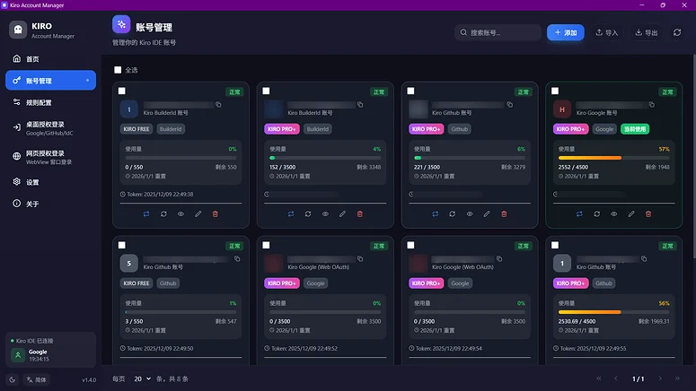
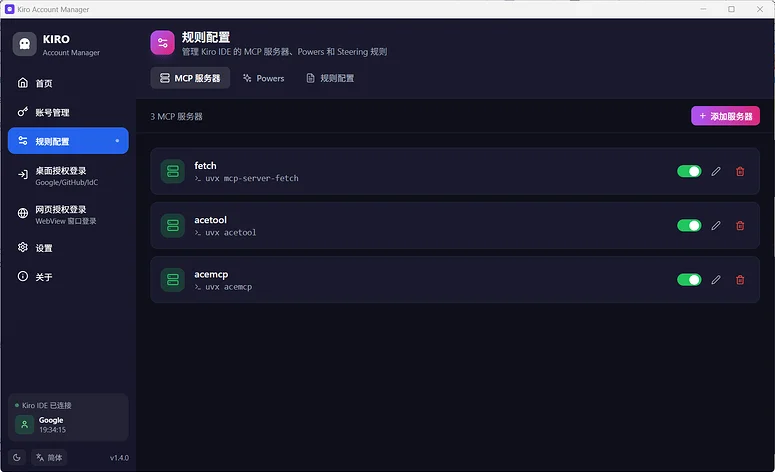

# Kiro Account Manager

<p align="center">
  
</p>

<p align="center">
  
  
  
  
  
  
  
</p>

<p align="center">
  <b>🚀 Умное управление аккаунтами Kiro IDE - переключение одним кликом, мониторинг квоты</b>
</p>

<p align="center">
  🌐 <b><a href="https://kiro-website-six.vercel.app">Официальный сайт</a></b> | 
  📥 <b><a href="#-download">Скачать сейчас</a></b> | 
  💬 <b><a href="https://t.me/ide520">Telegram Сообщество</a></b>
</p>

> **📢 Поддержка языков**: Этот проект поддерживает интерфейсы на **китайском (упрощённом), английском и русском** языках.

---

## 🏗️ Обзор проекта

Kiro Account Manager - это десктопное приложение на базе **Tauri 2.x** для централизованного управления аккаунтами **Kiro IDE** и локальными конфигурациями.

**Технологический стек**: React 18 + Vite + shadcn/ui + TailwindCSS 4 | Rust + Tauri 2.x | Windows / macOS / Linux

**Основные модули**:
- Управление аккаунтами: импорт, экспорт, обновление, проверка, группировка, теги, удаление удалённо
- Аутентификация входа: Google / GitHub Social OAuth, AWS IAM Identity Center (BuilderId / Enterprise)
- Интеграция Kiro: переключение аккаунтов, синхронизация моделей / прокси / MCP / Steering / Skills / Hooks / Custom Agents / Powers
- Автоматизация: автообновление токенов, автопереключение при низком балансе, привязка и сброс ID машины
- Возможности десктопа: Deep Link OAuth обратный вызов, одиночный экземпляр, системный трей, автообновление
- Возможности шлюза: встроенный Kiro API Gateway, поддерживает Anthropic Messages, OpenAI Responses, Chat Completions и потоковую пересылку

---

## 📥 Скачать

**Последняя версия v1.9.1** (выпущена 2026-06-02): пожалуйста, посетите [Releases](https://github.com/hj01857655/kiro-account-manager/releases/latest) (автоматически поддерживается актуальной)

> Ссылки для скачивания ниже могут отставать, ориентируйтесь на Releases для последних версий.

| Платформа | Архитектура | Формат файла | Ссылка для скачивания |
|----------|-------------|-------------|---------------|
| 🪟 **Windows** | x64 | MSI установщик | [KiroAccountManager_1.9.1_x64_zh-CN.msi](https://github.com/hj01857655/kiro-account-manager/releases/download/v1.9.1/KiroAccountManager_1.9.1_x64_zh-CN.msi) |
| 🍎 **macOS** | Intel (x64) | DMG образ | [KiroAccountManager_1.9.1_x64.dmg](https://github.com/hj01857655/kiro-account-manager/releases/download/v1.9.1/KiroAccountManager_1.9.1_x64.dmg) |
| 🍎 **macOS** | Apple Silicon (M1/M2/M3) | DMG образ | [KiroAccountManager_1.9.1_aarch64.dmg](https://github.com/hj01857655/kiro-account-manager/releases/download/v1.9.1/KiroAccountManager_1.9.1_aarch64.dmg) |
| 🐧 **Linux** | x86_64 | AppImage | [KiroAccountManager_1.9.1_amd64.AppImage](https://github.com/hj01857655/kiro-account-manager/releases/download/v1.9.1/KiroAccountManager_1.9.1_amd64.AppImage) |
| 🐧 **Linux** | x86_64 | DEB пакет | [KiroAccountManager_1.9.1_amd64.deb](https://github.com/hj01857655/kiro-account-manager/releases/download/v1.9.1/KiroAccountManager_1.9.1_amd64.deb) |

> **Примечание по стилю macOS**: Если возникают проблемы с отображением стиля, пожалуйста, настройте на основе исходного кода текущего репозитория (у меня нет устройства macOS, не могу воспроизвести и отладить).

**Системные требования**:
- **Windows**: Windows 10/11 (64-bit), требуется [WebView2](https://developer.microsoft.com/microsoft-edge/webview2/) (встроен в Win11)
- **macOS**: macOS 10.15+ (Catalina и выше)
- **Linux**: архитектура x86_64, требуется WebKitGTK 4.0+

**Инструкции по установке**:
- **Windows**: дважды щёлкните файл `.msi` для установки
- **macOS**: откройте `.dmg`, перетащите в Applications, разрешите в "Безопасность и конфиденциальность" при первом запуске
- **Linux AppImage**: запустите напрямую после `chmod +x`
- **Linux DEB`: установите с помощью `sudo dpkg -i`

---

## 📸 Скриншоты







---

## ✨ Основные функции

### 🔐 Аутентификация входа
- **Social вход**: Google / GitHub OAuth, автоматическое обновление токена
- **IdC вход**: BuilderId / Enterprise, полный поток SSO OIDC

### 📊 Управление аккаунтами
- Двойной вид карточка / список, индикатор прогресса квоты, индикаторы типа подписки
- Обнаружение бана, обратный отсчёт истечения токена, выделение статуса
- Теги и группы, расширенная фильтрация (тип подписки / статус / степень использования)

### 🔄 Переключение аккаунтов одним кликом
- Бесшовное переключение аккаунтов Kiro IDE, автоматический сброс ID машины
- Автоматический пропуск заблокированных аккаунтов, автопереключение при низком балансе

### 📦 Пакетные операции
- Импорт / экспорт JSON, импорт из Kiro IDE / kiro-cli
- Пакетное обновление / удаление / присвоение тегов / удалённый выход

### 🔌 Синхронизация конфигурации Kiro
Управление всё в одном: серверы MCP, правила Steering, Hooks, Skills, Custom Agents, Powers

### ⚙️ Системные настройки
Четыре темы, блокировка модели ИИ, автономный режим агента, автообновление токена, конфигурация прокси

### 🌐 Kiro API шлюз
Встроенный шлюз, совместимый с OpenAI, поддерживает прямую интеграцию со сторонними инструментами, такими как Cursor / Continue / Cline.
- Совместим с Anthropic `/v1/messages`, OpenAI `/v1/responses`, `/v1/chat/completions`
- Интеллектуальное понижение модели, балансировка нагрузки нескольких аккаунтов, аутентификация API Key

---

## ❓ Часто задаваемые вопросы

**Q: Ошибка "bearer token invalid" при переключении аккаунтов**
A: Токен истёк, нажмите кнопку "Обновить" перед переключением.

**Q: macOS показывает "приложение повреждено и не может быть открыто"**
A: Выполните `xattr -cr /Applications/KiroAccountManager.app` и откройте снова.

**Q: Приложение не выходит после нажатия кнопки закрытия?**
A: Оно скрыто в системный трей, нажмите "Выйти из приложения" в меню трея для полного выхода.

**Q: Windows MSI показывает "установлена та же версия"**
A: Продолжайте установку (v1.8.3+ поддерживает обновление с перезаписью).

---

## 📝 Сборка из исходников

```bash
git clone https://github.com/hj01857655/kiro-account-manager.git
cd kiro-account-manager
npm install
npm run tauri dev    # Режим разработки
npm run tauri build  # Сборка релиза
```

Предварительные требования: Node.js 20+, цепочка инструментов Rust, системные зависимости WebView.

**⚠️ Этот проект навсегда бесплатен! Если кто-то взимает с вас плату, вас обманули!**

---

## 💬 Обратная связь

- 🐛 [Отправить Issue](https://github.com/hj01857655/kiro-account-manager/issues)
- 📢 Telegram Канал: [https://t.me/kiro520](https://t.me/kiro520)
- 💬 Telegram Сообщество: [https://t.me/ide520](https://t.me/ide520)

---

## 🤝 Спонсоры

<table>
  <tr>
    <td align="center" width="50%">
      <a href="https://fishxcode.com/" target="_blank"><b>🐟 FishXCode</b></a><br>
      <sub>Стабильная служба ретрансляции Claude API</sub>
    </td>
    <td align="center" width="50%">
      <a href="https://synai996.space/" target="_blank"><b>🤖 SynAI996</b></a><br>
      <sub>Высокопроизводительная платформа прокси API моделей ИИ</sub>
    </td>
  </tr>
</table>

## 💖 Спонсорство

Если этот проект помог вам, вы можете угостить автора кофе ☕ (пожалуйста, укажите ваше имя пользователя GitHub для удобного добавления в список спонсоров)

<p align="center">
  
  
</p>

Спасибо спонсорам: 🌟 [shiro123444](https://github.com/shiro123444)

---

## ⭐ История звёзд

[](https://star-history.com/#hj01857655/kiro-account-manager&Date)

---

## 📄 Лицензия

[CC BY-NC-SA 4.0](LICENSE) - **Коммерческое использование запрещено**

Это программное обеспечение предназначено только для обучения и общения. Пользователи несут ответственность за любые последствия, возникающие в результате использования этого программного обеспечения.

---

<p align="center">Сделано с ❤️ by hj01857655</p>
<p align="center"><sub>Последнее обновление: 2026-06-02 | Версия: v1.9.1</sub></p>